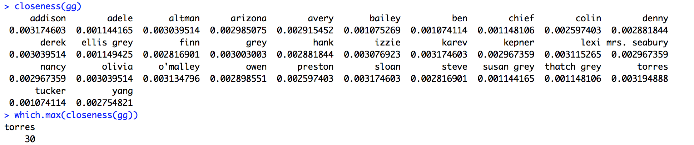
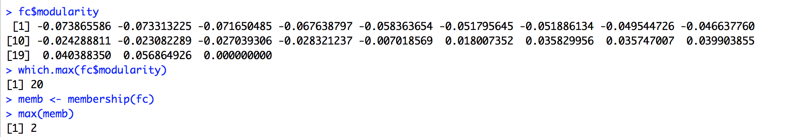

#QUESTION 1
```{r setup}
library('igraph')
library('sna')
ga.data <- read.csv('ga_edgelist.csv', header = T)
gg <- graph.data.frame(ga.data,directed = F)
```

### Create new graph from data and vrtx
```{r setup}
ga.data <- read.csv('ga_edgelist.csv', header=TRUE, stringsAsFactors=FALSE)
ga.vrtx <- read.csv('ga_actors.csv', header=TRUE, stringsAsFactors=FALSE)
gg <- graph.data.frame(ga.data, vertices=ga.vrtx, directed=FALSE)
```

### betweenness 
```{r setup}
betweenness(gg)
which.max(betweenness(gg))
```
 
### closeness
```{r setup}
closeness(gg)
which.max(closeness(gg))
```

 

####  eigenvector 
```{r setup}
eig <- eigen_centrality(gg)
eig$vector
which.max(eig$vector)
```

 
###  modularity and plot seprated cumminuty by colors with betweenness
```{r setup}
fc <-  edge.betweenness.community(gg)
fc$modularity
which.max(fc$modularity)
memb <- membership(fc)
max(memb)
```


```{r setup}
plot(gg, vertex.size=10, vertex.label=NA,vertex.color=memb, asp=FALSE)
```

 
### modularity and plot seprated cumminuty by colors with eigenvector
```{r setup}
dc <- leading.eigenvector.community(gg)
dc$modularity 
which.max(dc$modularity)
membTwo <- membership(dc)
max(membTwo)
```


```{r setup}
plot(gg, vertex.size=10, vertex.label=NA,vertex.color=membTwo, asp=FALSE)
```

 

#QUESTION 2 USING TWITTER DATA 
```{r setup}
load('termDocMatrix.rdata')
termDocMatrix[1:20,1:20]
```
###  change it to a Boolean matrix
```{r setup}
termDocMatrix[termDocMatrix>=1] <- 1
```
###  transform into a term-term adjacency matrix
```{r setup}
termMatrix <- termDocMatrix %*% t(termDocMatrix)
```
### inspect terms numbered 5 to 10
```{r setup}
termMatrix[5:10,5:10]
```
###  build a graph from the above matrix
```{r setup}
g <- graph.adjacency(termMatrix, weighted=T, mode = "undirected")
```
###  remove loops
```{r setup}
g <- simplify(g)
```
###  set labels and degrees of vertices
```{r setup}
V(g)$label <- V(g)$name
V(g)$degree <- degree(g)
```
###  Set the label size of vertices based on their degrees , label.cex - The font size for vertex labels.
```{r setup}
V(g)$label.cex <- 2.2 * V(g)$degree / max(V(g)$degree) + .2
```
###  rgb(red, green, blue, alpha) - defines a color, with an alpha transparency.
```{r setup}
V(g)$label.color <- rgb(0, 0, .2, .8)
V(g)$frame.color <- NA
```
###  Set the width and transparency of edges based on their weights.
```{r setup}
E(g)$weight
egam <- (log(E(g)$weight)+.4) / max(log(E(g)$weight)+.4)
E(g)$color <- rgb(.5, .5, 0, egam)
E(g)$width <- egam
```
###  plot the graph in layout1
```{r setup}
plot(g, layout=layout1)
```

###  set seed to make the layout reproducible
```{r setup}
set.seed(3952)
layout1 <- layout.fruchterman.reingold(g)
plot(g, layout=layout1)
```
###  Betweeness 
```{r setup}
betweenness(g)
which.max(betweenness(g))
```

###  Closeness
```{r setup}
closeness(g)
which.max(closeness(g))
```

###  Eigenvector
```{r setup}
eig <- eigen_centrality(g)
which.max(eig$vector)
```

###  modularity and plot seprated cumminuty by colors by betweenness
```{r setup}
edge.betweenness.community(g)
```

```{r setup}
fc <-  edge.betweenness.community(g)
fc$modularity
which.max(fc$modularity)
memb <- membership(fc)
max(memb)
```


```{r setup}
plot(g, vertex.size=10, vertex.label=NA,vertex.color=memb, asp=FALSE)
```


###  modularity and plot seprated cumminuty by colors with eigenvector
```{r setup}
leading.eigenvector.community(g)
```

```{r setup}
dc <- leading.eigenvector.community(g)
dc$modularity 
which.max(dc$modularity)
membTwo <- membership(dc)
max(membTwo)
```


```{r setup}
plot(g, vertex.size=10, vertex.label=NA,vertex.color=membTwo, asp=FALSE)
```


